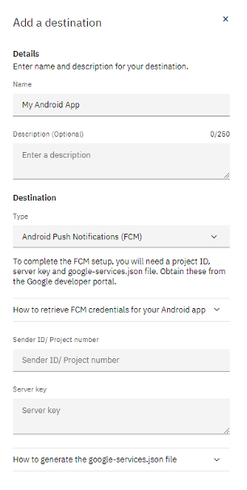
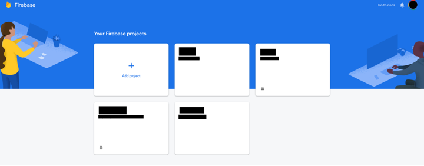

---

copyright:
  years: 2022
lastupdated: "2022-03-16"

keywords: event-notifications, event notifications, notifications, destinations, push, migration

subcollection: event-notifications

content-type: tutorial
account-plan: lite
completion-time: 10m

---

{{site.data.keyword.attribute-definition-list}}
{:codeblock: .codeblock}
{:external: target="_blank" .external}
{:important: .important}
{:note: .note}
{:pre: .pre}
{:screen: .screen}
{:shortdesc: .shortdesc}
{:tip: .tip}
{:download: .download}
{:term: .term}
{:external: target="_blank" .external}
{:step: data-tutorial-type='step'}
{:codeblock: .codeblock}

## Introduction
{{site.data.keyword.en_full}} is an event notification routing service that notifies you to critical events that occur in your IBM Cloud account or triggers
automated actions by using webhooks. You can filter and route event notifications from your IBM Cloud account to Email, SMS, Webhooks and Push Notifications. 
You can migrate your mobile apps from the deprecated IBM Cloud Push Notifications service to {{site.data.keyword.en_short}} to continue to use Push. 
This guide outlines the steps to migrate your mobile apps and the backend to integrate with the {{site.data.keyword.en_short}} service.

Broadly there are 5 steps needed
* Create and configure a new instance of {{site.data.keyword.en_full}}
* Modify your Mobile app to work with the {{site.data.keyword.en_short}} service 
* Modify your backend to integrate with the new API of {{site.data.keyword.en_short}} service 
* Release the new version of the mobile app 

## New Instance of the {{site.data.keyword.en_short}} service

First you have to create a new instance of the {{site.data.keyword.en_short}} service.  For the purpose of this exercise, we will not use any advanced capabilities of 
the {{site.data.keyword.en_short}} service. Within the service, you will create an API source, a Topic, a Subscription and a destination as per the following diagram. 
For a more detailed explanation of the concepts of {{site.data.keyword.en_short}} you can refer to the documentation.

{: caption="Figure 1. Push capability in Event Notifications" caption-side="bottom"}

## Create Source
Create an API Source. This Source will represent the backend from which you will be sending the notifications from.

## Create Topic
Create a Topic where all the events from the backend will flow into. We will not do any filtering but define a filter that will send all events from the Source to this Topic.

## Create Destination
Create a Destination of the required platform. We will discuss more about the destinations in the mobile platform specific sections below.

## Create Subscription
Create a subscription from the topic to the Destination.

## Create Service Credentials
Create a new set of credentials with the role of “Device Manager” 

## Modify Android Mobile applications
The mobile app source code has to be modified to use the new Event Notifications SDKs. We will be replacing the existing Push Notifications service SDK to Event notifications FCM SDK.

## Create Android Destination
For the Android app a new Destination of type Android Push Notification (FCM) will have to be created. Here provide the Sender ID and Server Keyfrom your Google console. 

{: caption="Figure 2. Create Android destination" caption-side="bottom"}

## Modify your project in Firebase console 
The package name for the Push Notifications SDK was “com.ibm.mobilefirstplatform.clientsdk.android.push” . The new Event Notification SDK has the package “com.ibm.cloud.eventnotifications.destination.android”. 
You need to update your project in Firebase Console with the new package and downloadand replace the newgoogle-services.jsonfile in your Android project.

* Visit the Firebase Console

{: caption="Figure 3. Firebase Console" caption-side="bottom"}

* Select the project that you are using for Push Notifications. 

{: caption="Figure 4. Select project" caption-side="bottom"}

* In the navigation pane, select the settings icon next to the Project Overviewand select Settings > Project settings. 
Scroll down to locate “Your apps

{: caption="Figure 5. Project setting" caption-side="bottom"}

* You will find an app with package name “com.ibm.mobilefirstplatform.clientsdk.android.push”. 
Click “Remove this app”. 

* Click “Add app” -> Choose Android -> Provide “com.ibm.cloud.eventnotifications.destination.android” as the package name -> Register App

{: caption="Figure 6. Register app" caption-side="bottom"}

* Download the “google-services.json”. This file will be used later while modifying the app.

## Edit the Android app

* Add the Firebase google-services.json in the app module. 
* Change the Module’s build.gradlefile to include the new SDKs

{: caption="Figure 7. Modify build" caption-side="bottom"}

* Open the AndroidManifest.xml and change the following
* Change the <service> section to refer to the new service

{: caption="Figure 8. Modify manifest" caption-side="bottom"}

* Change the <activity> section to point to the new class

{: caption="Figure 9. Modify activity" caption-side="bottom"}

* Next step is to change the import statements in the code. The new package name is com.ibm.cloud.eventnotifications.destination.android.*. 
Replace the old push import as shown below,

{: caption="Figure 10. Modify import" caption-side="bottom"}

* Initialize the new SDK  

{: caption="Figure 11. Initialize SDK" caption-side="bottom"}

There are additional fields like destinationID and apikey in new initialize() method.
Visit this link <add a link here> for obtaining the apikey for client SDK. 

* Callback class in the new SDK has changes. Make changes in the listener

{: caption="Figure 12. Change listener" caption-side="bottom"}

* Make changes in the device registration step 
If you are registering without userID

{: caption="Figure 13. Modify manifest" caption-side="bottom"}

* If you are using registerDeviceWithUserId

{: caption="Figure 14. Modify manifest" caption-side="bottom"}

* Make changes to the unregister API call.

{: caption="Figure 15. Modify manifest" caption-side="bottom"}

* Optionally, if you are using Tags.
Make the flowing changes to tag subscriptions

{: caption="Figure 16. Modify manifest" caption-side="bottom"}

Changes to get all the tag subscription for the device

{: caption="Figure 17. Modify manifest" caption-side="bottom"}

Make changes to tag unsubscribe

{: caption="Figure 18. Modify manifest" caption-side="bottom"}

* Optionally - If you are using Notification options, follow these changes
Initializing the class

{: caption="Figure 19. Modify manifest" caption-side="bottom"}

Changes to Notification Button

{: caption="Figure 20. Modify manifest" caption-side="bottom"}

Changes to Notification category 

{: caption="Figure 21. Modify manifest" caption-side="bottom"}

Changes to the Notification actions listener

{: caption="Figure 22. Modify manifest" caption-side="bottom"}

Your mobile app is ready to work with your new instance of Event Notifications.

## Modify iOS Mobile apps
The mobile app source code has to be modified to use the new Event Notifications SDKs. We will be replacing the existing Push Notifications service SDK to Event notifications iOS SDK.

## Create iOS Destination
For the iOS app a new Destination of type Apple Push Notification (APNs) will have to be created. Here provide the P12 or P8 and their configurations.

{: caption="Figure 23. Modify manifest" caption-side="bottom"}

## Edit the iOS application
Follow the below steps to migrate from BMPush to ENPushDestination
* Change the import statement

{: caption="Figure 24. Modify manifest" caption-side="bottom"}

* Replace SDK Initialization code as follows

{: caption="Figure 25. Modify manifest" caption-side="bottom"}

There are additional fields like destinationID and apikey in new initialize() method.
Visit this link <add link> for obtaining the apikey for client SDK.

* Make changes in the device registration step 
If you are registering without userID

{: caption="Figure 26. Modify manifest" caption-side="bottom"}

If you are using user ID for registration

{: caption="Figure 27. Modify manifest" caption-side="bottom"}

Make changes to the unregister API call.
{: caption="Figure 28. Modify manifest" caption-side="bottom"}

Optionally – if you are using Tags
Make the flowing changes to tag subscriptions
{: caption="Figure 29. Modify manifest" caption-side="bottom"}

Changes to get all the tag subscription for the device
{: caption="Figure 30. Modify manifest" caption-side="bottom"}

Make changes to tag unsubscribe
{: caption="Figure 31. Modify manifest" caption-side="bottom"}

* Optionally -If you are using Notification options, follow these changes
Initializing the class
{: caption="Figure 32. Modify manifest" caption-side="bottom"}

Changes to Notification Button
{: caption="Figure 33. Modify manifest" caption-side="bottom"}

Changes to Notification category
{: caption="Figure 34. Modify manifest" caption-side="bottom"}

Your mobile app is ready to work with your new instance of Event Notifications.

## Modify the backend
This section contains the steps required to be performed in the backend side.  The send notification API has changed and hence all the SDKs as well. 

# If you are using the Node.js SDK 
The existing Node SDK will have to be migrated to the new Event Notifications SDK. Follow this link for the new Node Admin SDK documentation. 
* Changes in importing the SDK
{: caption="Figure 35. Modify manifest" caption-side="bottom"}

* Changes in initializing the SDK
{: caption="Figure 36. Modify manifest" caption-side="bottom"}

* Changes in creating notification targets
{: caption="Figure 37. Modify manifest" caption-side="bottom"}

* Changes in the FCM style payload
{: caption="Figure 38. Modify manifest" caption-side="bottom"}

* Changes in FCM message body
{: caption="Figure 39. Modify manifest" caption-side="bottom"}

* Changes in Send notification method
{: caption="Figure 40. Modify manifest" caption-side="bottom"}

# If you are using REST API
This section contains the details about the modifications required for Send Notifications API. In the new API we have additional parameters
in the request body. The required parameters for Android push notifications are as given below
{: caption="Figure 41. Modification to REST API1" caption-side="bottom"}

For a detailed description of the event attributes please see the EN event attribute definition.

{: caption="Figure 42. Modification to REST API2" caption-side="bottom"}

•`target` field is replaced by `ibmenpushto`
•`message` field is removed. The alert, url fields are part of the `ibmenfcmbody`.
•`settings->gcm` is replaced by `ibmenfcmbody`.

The push_tofields can take four values same as `target` of push API. 
1.tags –array of tag names
2.user_ids –array of user ids. 
3.fcm_devices–array of device Ids.
4.platforms –the target device platform. 

The ibmenfcmbodyfield contains every field in the settings-> gcmfield of IBM Cloud Push notifications service, but with some changes, 
1. All fields are in snake case instead of camel case. For examples,interactiveCategorywill be interactive_category. 
2. We don’t support the channels and channel groups. 

# Release new version of the app

After the integration is complete –the new version of the App will have to be released. In the new version ask the user permission to send notification and register the device again.In the overlapping window when the user population is migrating from the old version of the app to the new version, the notifications may have to be sent to the existing Push Notification environment as well as the new Event Notifications environment.

