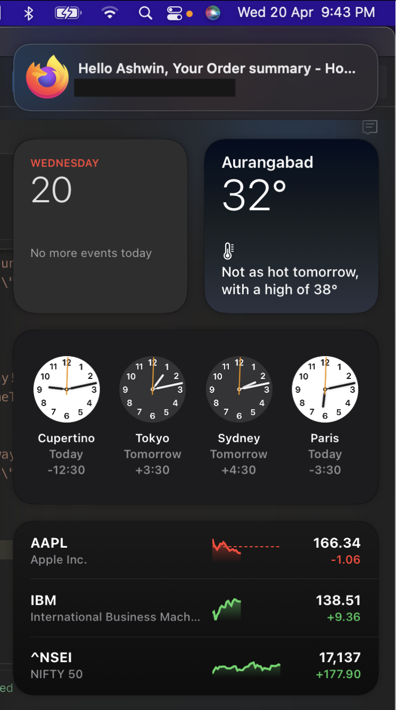

---

copyright:
  years: 2022
lastupdated: "2022-02-16"

keywords: event-notifications, event notifications, about event notifications, destinations, push

subcollection: event-notifications

content-type: tutorial
account-plan: lite
completion-time: 10m

---

{{site.data.keyword.attribute-definition-list}}
{:codeblock: .codeblock}
{:external: target="_blank" .external}
{:important: .important}
{:note: .note}
{:pre: .pre}
{:screen: .screen}
{:shortdesc: .shortdesc}
{:tip: .tip}
{:download: .download}
{:term: .term}
{:external: target="_blank" .external}
{:step: data-tutorial-type='step'}
{:codeblock: .codeblock}

# Create and send push notifications to Firefox web using {{site.data.keyword.en_full}}
{: #en-push-firefox}
{: toc-content-type="tutorial"}
{: toc-completion-time="10m"}

Create an {{site.data.keyword.en_short}} service, add a push destination for Firefox, and send messages to Firefox web devices.
{: shortdesc}

## What is {{site.data.keyword.en_short}}?
{: #en-what-is}

{{site.data.keyword.en_short}} is an event notification routing service that notifies you of critical events that occur in your {{site.data.keyword.Bluemix_notm}} account or triggers automated actions by using webhooks. You can filter and route event notifications from {{site.data.keyword.Bluemix_notm}} services like {{site.data.keyword.prf_hubshort}}, to email, SMS, push notifications, and webhooks.

## How do clients use Firefox Web Push Notifications?
{: #en-how-clients-send}

The following diagram shows you how clients use Firefox web Push Notifications.

{: caption="Figure 1. How clients use push notifications" caption-side="bottom"}

## Objectives

{: #en-objectives}

This tutorial shows you how to send push notifications as follows:

* Create a website with {{site.data.keyword.en_short}}.
* Get Firefox web credentials.
* Download the SDK and complete the notifications setup.
* Configure and send Firefox web push Notifications to a browser.

## Create an {{site.data.keyword.en_short}} service instance
{: #en-create-event}
{: step}

* Log in to your [{{site.data.keyword.Bluemix_notm}} account](https://cloud.ibm.com/).
* In the [{{site.data.keyword.Bluemix_notm}} catalog](https://cloud.ibm.com/catalog#services), search `Event Notifications > Event Notifications`.
* Select a `Region` from the list of supported regions and select a `pricing plan`.
* Provide a `Service name`.
* Select a `resource group`.
* Click `Create`.

## Add a generic API source
{: #en-add-gen-api}
{: step}

Take the following steps:

* Go to the `Sources` section of the {{site.data.keyword.en_short}} dashboard.
* Click `Add` and select an API Source.
* Type a name and an optional description and click `Add`.

## Create an {{site.data.keyword.en_short}} destination
{: #en-create-dest}
{: step}

Click `Destinations` in the {{site.data.keyword.en_short}} console and add the following destination details:

* `Destination name`: add a name for the Destination.
* `Destination description`: add an optional description for the destination.
* `Destination type`: select Firefox Push Notifications type from the dropdown list.
* Provide the Website URL of your website.

## Create an {{site.data.keyword.en_short}} topic
{: #en-create-topic}
{: step}

Select `Topics` in the Event Notifications console and click `Create`. Enter the following topic details:
* `Name`: enter a name for the topic.
* `Description`: add an optional description for the topic.
* `Source`: select a source from the dropdown list.
* `Event type`: select event type from the dropdown list.
* `Event sub type` select event sub type from the event sub type dropdown list.
* `Severity`: select severity from the severity dropdown list.
* `Advanced conditions`: write your own custom conditions, which must follow [jsonpath specifications](https://jsonpath.com/).

## Create an {{site.data.keyword.en_short}} subscription
{: #en-create-sub}
{: step}

Click `Subscriptions` in the {{site.data.keyword.en_short}} console. Enter the following subscription details:

* `Click` Create to display subscription wizard.
* Complete the following subscription details: 
   * `Subscription name`: name of the subscription.
   * `Subscription description`: add an optional description.
* Under the `Subscribe to a topic` section, select a topic from the drop-down list and select a destination from the destination drop-down list.
* `Destination type`: select type under `Destination` and click `Add`.


## Set up {{site.data.keyword.en_short}} Firefox web SDK
{: #en-setup-firefox-sdk}
{: step}

The Firefox web SDK enables Firefox websites to receive push notifications. Complete the following steps to install {{site.data.keyword.en_short}} Firefox web SDK, initialize the SDK, and register for notifications for your website.

* To include the SDK in your project Add the `ENPushSDK.js`,`ENPushServiceWorker.js` and `manifest_Website.json` files to your project root folder.

* Edit the manifest_Website.json file.

  ```js
   {
     "name": "YOUR_WEBSITE_NAME"
    }
   ```

* Change the `manifest_Website.json` file name to `manifest.json`.

* Include the manifest.json in <head> tag of your html file.

  ```html
    <link rel="manifest" href="manifest.json">
  ```

* Include IBM Cloud Web push SDK to the script ,

  ```html
   <script src="ENPushSDK.js" async></script>
  ```

* Complete the following steps to enable Website to initialize the SDK

  ```js
  var enPush = new ENPush()

  function callback(response) {
    alert(response.response)
  }

  var initParams = {
    "instanceGUID": "<instance_guid>",
    "apikey": "<instance_apikey>",
    "region": "<region>",
    "deviceId": "<YOUR_DEVICE_ID>",
    "firefoxDestinationId": "<firefox_destination_id>",
    "firefoxApplicationServerKey": "<Firefox_VapId_public_key>"
  }

  enPush.initialize(initParams, callback)

  ```

  * region : Region of the Event Notifications Instance. eg; `us-south`,`eu-gb`, `au-syd` and `eu-de`

  * deviceId: Optional deviceId for device registration.

* To register for notifications Use the `register()` or `registerWithUserId()` API to register the device with IBM Cloud Event Notifications service. Choose either of the following options:

  * Register without `UserId`:

  ```js
    enPush.register(function(response) {
      alert(response.response)
    })
  ```

  * Register with UserId. For `userId` based notification, the register method will accept one more parameter - `userId`

  ```js
    bmsPush.registerWithUserId("UserId",function(response) {
      alert(response.response)
    })
  ```

  `UserId` is the user identifier value with which you want to register devices in the push service instance.

* The `subscribe` API will subscribe the device for a given tag. After the device is subscribed to a particular tag, the device can receive notifications that are sent for that tag. Add the following code snippet to your web application to subscribe to a list of tags.

  ```js
    enPush.subscribe(tagName, function(response) {
      alert(response.response)
    })
  ```

* When the setup is complete, run your application and register for push notifications.

## Send notifications to the Firefox device
{: #en-send-notifications}
{: step}

Use the [Send Notification API](https://cloud.ibm.com/apidocs/event-notifications/event-notifications#send-notifications) to send the push notification for the Firefox device. You can use the [Node](https://github.com/IBM/event-notifications-node-admin-sdk#send-notifications) or [Go](https://github.com/IBM/event-notifications-go-admin-sdk#send-notifications) admin SDK instead of calling the API directly.


{: caption="Figure 7. Receive notifications" caption-side="bottom"}
